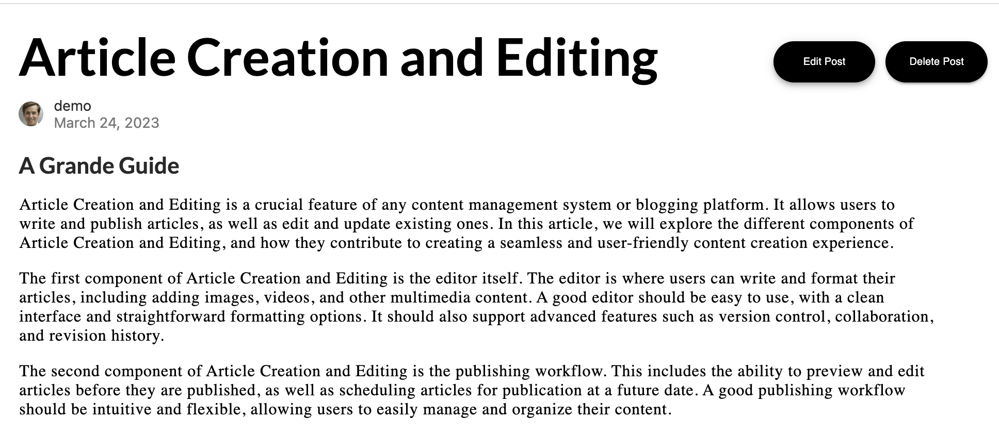

# Grande - A Medium.com Clone
[Grande - Live Site](https://grande-means-medium.herokuapp.com/#)

Grande is a fullstack web application inspired by Medium.com. It allows users to create an account, write and publish articles, and read and interact with content created by other users. The project is built using Ruby on Rails and PostgreSQL on the backend. You can visit the live site [here](https://grande-means-medium.herokuapp.com).


## 📖 Table of Contents

- [Technologies Used](#technologies-used)
- [Key Features](#key-features)
  - [User Authentication](#user-authentication)
  - [Article Creation and Editing](#article-creation-and-editing)
  - [Bookmarking](#bookmarking)
  - [Following Users](#following-users)
  - [User Profiles](#user-profiles)
- [Future Directions](#future-directions)

## 🛠️ Technologies Used

- Rails
- PostgreSQL
- HTML/CSS
- JavaScript
- Hosting: Heroku (app and database), GitHub (public repo)

## 🔑 Key Features

### User Authentication

In Grande, user authentication is implemented using a secure, encrypted cookie-based system for managing user sessions, while Rails' built-in validation features and strict input validation checks prevent security vulnerabilities during registration and login. A notable feature is the automatic creation of user profiles during registration for a streamlined and personalized experience.

```ruby
class User < ApplicationRecord
    has_many :bookmarks
    has_many :followings
    has_many :posts
    has_one :profile
    validates :username, :session_token, presence: true
    validates :email, presence: true, uniqueness: true
    validates :password, length: { minimum: 6, allow_nil: true }
    after_initialize :ensure_session_token!
    after_create :create_profile   #profile auto create after user creation
    def create_profile
        self.profile = Profile.new
        save
    end
    attr_reader :password
```

### Article Creation and Editing

In Grande, I developed the Article Creation and Editing feature to enable users to draft, edit, and publish articles while maintaining a high level of flexibility for formatting and styling. To address the challenge of facilitating easy content manipulation, including text formatting and multimedia embedding, I integrated the draft.js library as a rich text editor into the frontend of the application. 

Additionally, I implemented a role-based access control system on the backend using Rails to manage permissions for article editing and deletion. These solutions provide users with a seamless and secure tool for crafting and sharing their written work.

 

### Bookmarking

In Grande, I developed a User-Specific Content Bookmarking system that allows users to save and organize their favorite articles within the platform. This feature makes it easy for users to access and revisit the content they find interesting.

A main challenge I faced was designing an efficient and user-friendly interface for managing bookmarks. I created a dedicated bookmark management section within the user's profile, making it simple for users to manage their saved articles.

Another challenge was ensuring that the bookmarking feature was scalable and performant as the platform grew. I used caching mechanisms and optimized database queries to keep server response times low and reduce backend load.

Maintaining data consistency and integrity was also important. I implemented error-handling mechanisms to catch and resolve any potential inconsistencies, ensuring the reliability of the bookmarking system.

```ruby
 def index 
      
      @posts = Post.select("posts.*, bookmarks.id as post_id,bookmarks.user_id").left_joins(:bookmarks).all
      # @posts.bookmarks
      render json: @posts
end

```
In the posts controller, Grande retrieves all posts from the database, and their corresponding bookmarks (if any), and associates them together. This allows for easy access to both posts and their associated bookmarks, which is useful because users want to save and revisit content they find interesting.


### Following Users 

In Grande, I added a user-following feature that allows users to connect with other users and stay updated on their latest posts. Users can easily follow or unfollow other users by clicking a "Follow" button on the user's profile page. Once a user follows another user, the posts from the followed user will appear on the follower's "Following" page. This personalized feed displays the latest content from the users they follow, fostering user engagement and community interaction within the platform.

```ruby
 create_table "followings", force: :cascade do |t|
    t.integer "user_id"
    t.integer "follower_id"
    t.integer "followed_id"
    t.datetime "created_at", null: false
    t.datetime "updated_at", null: false
  end
```

By using three different columns to represent the different types of users involved, the Grande database schema allows for flexible querying and efficient data retrieval when displaying the "Following" page to the user. This approach also ensures that the database table remains normalized, which can help prevent data inconsistencies and redundancies.

### User Profiles
In Grande, I developed a user profile feature that allows users to upload a profile photo, choose a display name, and write a brief bio. This feature enhances user engagement and fosters a sense of community by giving users a recognizable identity. Implementing the feature involved handling user-uploaded images, storing profile data efficiently, and providing a responsive user interface.

The username, bio, and photo appear in several places across the site.


## 🚀 Future Directions

In future versions of Grande, I plan to enhance the user experience and engagement by introducing several new features:

- **Comments section**: Allowing users to discuss and share their thoughts on articles, fostering interaction among readers and authors.
- **Tagging system**: Making it easier for users to discover and navigate content based on specific topics or interests.
- **Trending topics**: Highlighting popular and relevant content to users, promoting discovery and engagement.
- **Voting system**: Enabling users to express their appreciation for articles and providing authors with valuable feedback.
- **Monetization options**: Exploring subscriptions, paywalls, or revenue-sharing, allowing authors to earn from their contributions to Grande.

These future features aim to create a more interactive, dynamic, and rewarding environment for both readers and authors on the platform.
